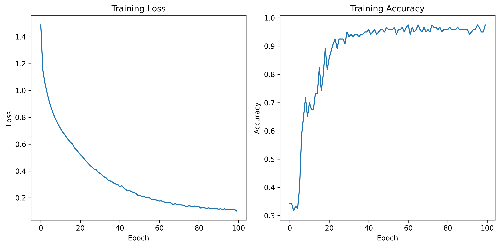

# Initialize GPU Environment

## TO-DO

1. Follow the guide
1. check if everything worked by running `main.ipynb`
1. check how models are made in TensorFlow by running `MODEL.ipynb`

## Desired end result

Or something like it

